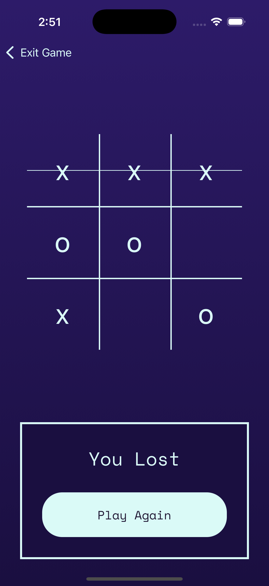

# REACT NATIVE TIC TAC TOE

## Project Overview

This project is a single-player unbeatable Tic Tac Toe game built in React Native and Expo, featuring an AI opponent that uses the minimax algorithm to make optimal moves.

## How to run the project locally

1. Clone the repository

   ```bash
   git clone https://github.com/Semkoo/react-native-tic-tac-toe.git
   cd react-native-tic-tac-toe
   ```

2. Install dependencies

   ```bash
   npm install
   ```

3. Start the development server

   ```bash
   npx expo start
   ```

4. Run the app:
   - Scan the QR code with Expo Go (Android) or Camera app (iOS)
   - Press 'a' for Android emulator
   - Press 'i' for iOS simulator
   - Press 'w' to run in web browser

**Requirements:**

- Node.js 20 or higher
- npm or yarn or pnpm or bun
- Expo Go app (for mobile testing)
- Android Studio (for Android emulator)
- Xcode (for iOS simulator, macOS only)
- Prettier & ESLint - For code quality

## Project Requirements

1. Can start a new Tic Tac Toe game on a 3x3 grid
2. User can opt to go first or let computer go first
3. If User wins, game must display a "You Won" screen
4. If User loses, game must display a "You Lost" screen
5. User can start a new game once current one is completed
6. All games must result in either end in a tie or user loss. The computer player has to be unbeatable.
7. Must provide a Readme containing instructions on how to run the game as well as technical details explaining their approach and tools used.

## Tech Stack

- React Native
- TypeScript
- Expo
- ESLint & Prettier - For code quality
- Jest

## Approach

### Game Logic

The game implements the following key components:

1. **Game State Management**

   - Board represented as a 3x3 array

2. **AI Implementation**

   - Minimax algorithm for unbeatable AI moves
     - The minimax algorithm is a decision rule used to determine the best possible move in games where all possible moves can be foreseen like tic-tac-toe or chess.
     - The algorithm works by exploring all possible moves and selecting the one that maximizes the score for the current player while minimizing the score for the opponent.
     - The algorithm is recursive and explores all possible moves and scores them. The score is calculated based on the total score and the depth of the move. The depth is the number of moves made from the current position to the end of the game .

3. **Win Detection**
   - Check rows, columns, and diagonals
   - Evaluate board state after each move

### UI/UX

The interface is designed with the following considerations:

1. **Game Flow**

   - Welcome screen with new game button
   - Game screen with game board
     - Let the user choose if they want to go first or let the computer go first
     - Game board with 3x3 grid
     - Game status messages for game progress
   - Reset button for new games

2. **Visual Design**
   - Clean, minimal interface
   - Responsive grid layout
   - Clear visual feedback for moves
   - Distinctive X and O symbols

## Project Structure

- This project is built on [Expo](https://expo.dev) and leverages [Expo Router](https://docs.expo.dev/router/introduction/) for navigation. The codebase follows this organizational structure:

```
app/
├── layout.tsx
├── index.tsx
└── game.tsx
components/
├── Board.tsx
├── ...
├── ui/
│   └── Text.tsx
└── GameStatus.tsx
utils/
├── board.ts
│   ├── minimax.ts
│   ├── types.ts
│   └── colors.ts
```

## Future Improvements

- Add move animations and transitions
- Implement sound effects for moves and game events
- Add difficulty levels (Easy, Medium, Unbeatable)
- Include game statistics tracking
- Add multiplayer support via local play
- Implement undo/redo functionality

## Screenshots

### Home Screen


### Game Screen, Draw Screen, and Lost Screen

  

---

## Expo app 👋

This is an [Expo](https://expo.dev) project created with [`create-expo-app`](https://www.npmjs.com/package/create-expo-app).

## Get started

1. Install dependencies

   ```bash
   npm install
   ```

2. Start the app

   ```bash
    npx expo start
   ```

In the output, you'll find options to open the app in a

- [development build](https://docs.expo.dev/develop/development-builds/introduction/)
- [Android emulator](https://docs.expo.dev/workflow/android-studio-emulator/)
- [iOS simulator](https://docs.expo.dev/workflow/ios-simulator/)
- [Expo Go](https://expo.dev/go), a limited sandbox for trying out app development with Expo

You can start developing by editing the files inside the **app** directory. This project uses [file-based routing](https://docs.expo.dev/router/introduction).

## Get a fresh project

When you're ready, run:

```bash
npm run reset-project
```

This command will move the starter code to the **app-example** directory and create a blank **app** directory where you can start developing.

## Learn more

To learn more about developing your project with Expo, look at the following resources:

- [Expo documentation](https://docs.expo.dev/): Learn fundamentals, or go into advanced topics with our [guides](https://docs.expo.dev/guides).
- [Learn Expo tutorial](https://docs.expo.dev/tutorial/introduction/): Follow a step-by-step tutorial where you'll create a project that runs on Android, iOS, and the web.

## Join the community

Join our community of developers creating universal apps.

- [Expo on GitHub](https://github.com/expo/expo): View our open source platform and contribute.
- [Discord community](https://chat.expo.dev): Chat with Expo users and ask questions.
